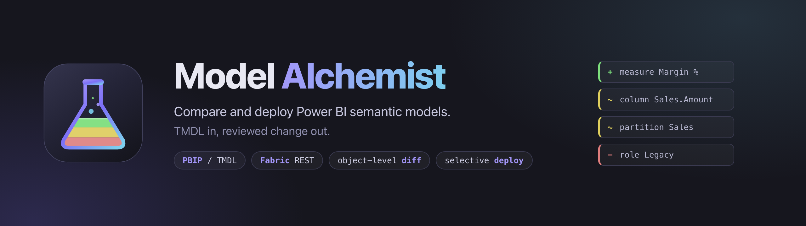

<p align="center">
  
</p>

<p align="center">
  <a href="#license"></a>
  
  
  
</p>

# Model Alchemist

**See exactly what changed between two Power BI semantic models, then deploy only the parts you picked.**

Model Alchemist is an open-source diff and deployment tool for Power BI semantic models in TMDL format. It reads two models, compares them object by object, and lets you promote a chosen subset of the differences instead of republishing the whole model. Each model can be a PBIP `.SemanticModel` folder on disk, a semantic model in Microsoft Fabric, or one of each. It runs locally as a small web app, and it can be launched straight from Power BI Desktop as an External Tool.

It exists because "publish" is all-or-nothing. When one measure needs to move from a development model to production, republishing carries every other unreviewed change with it, overwrites row-level security membership, and gives you no record of what actually shipped.

---

## What you get

| I want to… | Model Alchemist gives you | Jump to |
|---|---|---|
| **Know what changed** before anyone signs off | An object-level diff across 11 change groups, with the exact changed fragment highlighted inside DAX and Power Query | [See it working](#see-it-working) |
| **Ship one fix**, not the whole model | Tick the objects to promote. Everything else in the target is left byte-for-byte as it was | [How it works](#how-it-works) |
| **Not break production** | Six checks run before a single byte is written, and a failed write is rolled back | [Deploying safely](#deploying-safely) |
| **Compare a branch, or two Fabric workspaces** | Source and target are chosen independently: local, Fabric, or a mix | [Source and target](#source-and-target) |
| **Prove what shipped** | Per-object deploy log, plus CSV / Markdown / HTML export of any comparison | [Quickstart](#quickstart) |
| **Refresh only what needs it** | After a Fabric deploy, an Enhanced Refresh scoped to the affected tables with per-table status | [Deploying safely](#deploying-safely) |

---

## See it working

Two models of the same report: a feature branch on the left, main on the right. Eight differences, grouped, with the changed fragment highlighted inside the M query and the RLS filter.


Before anything is written, the preview lists every planned file operation and every warning the validator raised, including anything a block-level write would ship beyond the properties you reviewed.


---

## How it works

Three steps. Nothing is written until the third one, and you choose what it writes.

![How Model Alchemist works, in three steps. Step 1, Connect: source and target are chosen independently as a local .SemanticModel folder or a Fabric semantic model, authenticated with OAuth2 and PKCE in the browser with no credentials stored on disk. Step 2, Compare: TMDL is parsed into identity-keyed objects and diffed property by property, producing added, modified and removed entries, with changes that must ship together bound into atomic groups. Step 3, Deploy: dependency validation, a full-folder backup and a preview of every file operation run before a transactional local write or a Fabric updateDefinition upload followed by a scoped Enhanced Refresh.](assets/diagram-how-it-works.png)

---

## What it compares

Eleven change groups, each diffed at property level. Object identity is matched the way the Analysis Services engine does it, not the way the file happens to be written: names are compared case-insensitively, and the per-environment GUIDs that Power BI Desktop appends to partition names are normalised. A model compared against itself reports no differences.

![The eleven change groups Model Alchemist compares, each listed with the TMDL properties it reads. Tables and Relationships, Measures, Calculation Groups, Hierarchies, Roles and Row-Level Security, Perspectives, Translations, Data Sources and Parameters, Named Expressions, Functions, and Model Properties. A twelfth panel lists what is deliberately never compared: lineageTag, sourceLineageTag and PBI_ annotations, which are per-environment identifiers and Power BI runtime state preserved in the target on every write.](assets/diagram-coverage.png)

---

## Deploying safely

The target is someone's production model. Six gates stand between clicking Deploy and a changed model, and a local deploy that fails half-way puts every file back.

![The Model Alchemist deployment safety model. Before any write: dependency validation blocks on hard errors, cascade and cardinality warnings appear in the preview, a Fabric drift check blocks if the live model changed since the comparison, the whole .SemanticModel folder is backed up, and a dry-run preview lists every file operation without writing. Then the write applies only the ticked changes, transactionally for a local target and via updateDefinition for a Fabric target, followed by an Enhanced Refresh scoped to the affected tables.](assets/diagram-deploy-safety.png)

---

## Source and target

Both sides are chosen independently, so the same tool covers a pull-request review, a promotion to production, a drift audit and an environment comparison.


---

## Quickstart

```bash
npm install
npm start
```

The app opens at **http://localhost:3001**. Paste or browse to a `.SemanticModel` folder on each side, press **Compare Models**, then expand any row to see the changed fragment highlighted in place.

If port 3001 is taken the server steps to the next free port and prints the URL it bound.

### Requirements

| | |
|---|---|
| **Node.js** | v18 or newer (tested on v24) |
| **Models** | Power BI in PBIP / TMDL format. Enable Developer Mode in Power BI Desktop |
| **OS** | Windows 10/11 is the supported platform. The server itself runs anywhere Node runs, but the native folder picker and the launch-the-browser step use Windows APIs. Elsewhere, type or paste the model paths instead |
| **Fabric** *(optional)* | A Microsoft account with access to the workspace. Only needed for the Fabric source and target modes |

On Windows you can install Node with `winget install OpenJS.NodeJS.LTS`, then restart your terminal so `node` is on the PATH.

---

## Connecting to Microsoft Fabric

1. Click **Fabric** in the header and sign in with your Microsoft account. The sign-in happens in your own browser using OAuth2 Authorization Code with PKCE. No credentials pass through the app and none are written to disk.
2. Switch either model panel to its **Fabric** tab.
3. Paste the connection string from the workspace:
   ```text
   Data Source=powerbi://api.powerbi.com/v1.0/myorg/WorkspaceName;Initial Catalog=ModelName;
   ```
4. Click **Verify Access**.

The default OAuth client is the public Power BI Desktop client (`ea0616ba-638b-4df5-95b9-636659ae5121`), so no app registration is required.

---

## Running from Power BI Desktop

Model Alchemist can appear on the **External Tools** ribbon.

1. Open [`pbitool/model-alchemist.pbitool.json`](pbitool/model-alchemist.pbitool.json) and point `arguments` at your local `start.bat`:
   ```json
   "arguments": "/c \"D:\\model_alchemist\\start.bat\""
   ```
2. Copy that file into `C:\Program Files (x86)\Common Files\Microsoft Shared\Power BI Desktop\External Tools\` (as Administrator).
3. Restart Power BI Desktop.

Leave `path` as `C:\\WINDOWS\\System32\\cmd.exe`. Only the path inside `arguments` needs changing.

---

## FAQ

**What is Model Alchemist?**
A local web app that compares two Power BI semantic models in TMDL format and deploys a selected subset of the differences from one to the other. Both models can be local PBIP folders, Microsoft Fabric semantic models, or one of each.

**How is this different from publishing from Power BI Desktop?**
Publishing replaces the whole model. Model Alchemist writes only the objects you ticked, leaves everything else in the target untouched, and shows you the full plan before it writes. That matters most for row-level security membership, which differs between environments and is destroyed by a republish.

**Do I need PBIP or TMDL?**
Yes for local models. Enable Developer Mode in Power BI Desktop and save as a `.pbip` project; the model is then stored as TMDL text files that this tool reads directly. Fabric models are fetched as TMDL over the REST API, so nothing extra is needed there.

**Can I deploy just one measure?**
Yes. That is the point. Some changes genuinely cannot be split: a Power Query change and the columns that depend on it, a relationship and its endpoint columns, both halves of a rename. Those are bound into an atomic group, deploy as a unit, and the UI says so.

**Is it safe to point at production?**
It is built for that. Dependency validation blocks a deploy that would leave the model invalid, the whole `.SemanticModel` folder is backed up first, and a local deploy that fails part-way restores every file it touched. For a Fabric target it also re-fetches the live model and refuses to upload if someone published in between, rather than silently reverting their work.

**Does it store my credentials?**
No. Fabric sign-in uses OAuth2 with PKCE in your browser. Only an access token is held in memory for the life of the process, and it is dropped as soon as it expires.

**Does it refresh data after deploying?**
For a Fabric target it offers an Enhanced Refresh scoped to the tables the deployed changes actually affect, choosing the cheapest refresh that works for each (`dataOnly`, `calculate` or `automatic`), with per-table status. A `dataOnly` pass is followed automatically by a model-level recalculate so relationship indexes are rebuilt.

**Can two people use it at once?**
Each browser tab keeps its own comparison state on the server, so two tabs can hold two independent comparisons and deploy targets.

**Does it work on macOS or Linux?**
The server runs on any platform with Node.js and the comparison and deployment work. The native folder-picker button and the automatic browser launch are Windows-only; elsewhere, type or paste the model paths into the two inputs.

---

## Contributing

Project layout, the test suite, and how the images in this README are regenerated are documented in [CONTRIBUTING.md](CONTRIBUTING.md). Release history is in [RELEASE_NOTES.md](RELEASE_NOTES.md), and the reasoning behind the relationship cardinality warnings is in [RELATIONSHIP_CARDINALITY_WARNINGS.md](RELATIONSHIP_CARDINALITY_WARNINGS.md).

## License

MIT © [Radosław Górecki](https://github.com/goreckir)
